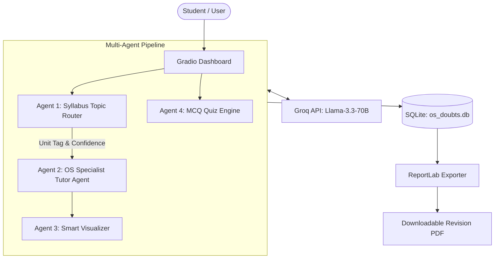

# 🧠 OS-MindAgent: Automated Doubt Resolution System for Operating Systems

> **Mini Project for Agentic AI & Automation (Course CA3)**  
> **Target Subject:** Operating Systems (Symbiosis International University Course T7510)  
> **Built with:** Groq Llama-3.3-70B • Gradio 4+ • SQLite • ReportLab PDF Exporter  

---

## 🌟 Key Features

1. **💬 Smart Doubt Resolver (Syllabus-Mapped)**: Multi-turn chat interface that automatically classifies student doubts into Symbiosis OS Units 1–5 and displays a **Confidence Score**.
2. **📊 On-Demand Visual Diagrams**: Renders interactive Mermaid.js Gantt charts (CPU Scheduling), Process State diagrams, Deadlock Resource Allocation Graphs (RAG), and Memory Paging layouts.
3. **📝 Unit-Wise MCQ Quiz Generator**: Dynamically generates 3-question exam-style practice quizzes per unit with immediate evaluation and detailed explanations.
4. **📥 History & Revision PDF Export**: Persists doubt logs in `os_doubts.db` (SQLite) and exports structured PDF revision sheets with a single click.
5. **📚 Syllabus Explorer**: Displays SIU T7510 course breakdown, topics, and recommended textbooks.

---

## 🏗 System Architecture



---

## 🚀 Quick Start Guide

### 1. Prerequisites & Installation
Ensure Python 3.10+ is installed on your system.

```bash
# Clone the repository
git clone https://github.com/your-username/OS-MindAgent.git
cd OS-MindAgent

# Install dependencies
pip install -r requirements.txt
```

### 2. Environment Configuration (Optional)
Create a `.env` file or set your `GROQ_API_KEY`:

```env
GROQ_API_KEY=your_groq_api_key_here
```
*(Note: If no API key is provided, OS-MindAgent operates seamlessly in offline fallback mode).*

### 3. Launch the Application
```bash
python app.py
```
Open your browser and navigate to `http://127.0.0.1:7860`.

---

## 📁 Repository Structure

```
flexi_credit/
├── app.py                             # Main Gradio application entry point
├── config.py                          # Groq model settings & Symbiosis T7510 OS syllabus
├── requirements.txt                   # Dependency manifest
├── README.md                          # Project documentation
├── viva_cheat_sheet.md                # Viva preparation guide
├── OS_MindAgent_Mini_Project_Report.docx # Filled Word project report
├── OS_MindAgent_Mini_Project_Presentation.pptx # Filled presentation slides
├── agent/
│   ├── router.py                      # Topic classification & confidence calculator
│   ├── solver.py                      # Core OS tutor agent (Groq Llama-3.3-70B)
│   ├── diagram.py                     # Mermaid.js visual diagram generator
│   └── quiz.py                        # Dynamic MCQ quiz generator
└── database/
    ├── db.py                          # SQLite database CRUD operations
    └── pdf_exporter.py                # ReportLab PDF summary generator
```

---

## 📄 License & Attribution
Submitted in partial fulfillment of the requirements for 3rd Year B.Tech CSE at Symbiosis Institute of Technology (SIT), Nagpur.
